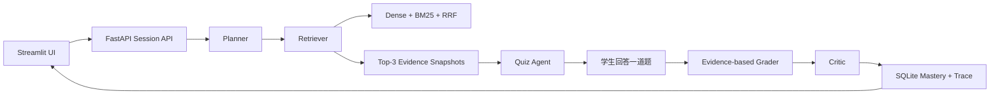

# final-agent：多 Agent + RAG 课程复习教练

`final-agent` 是一个面向课程资料复习的可落地 AI/RAG 应用。它把 PDF 或 Markdown
课件构建为按课程隔离的混合检索知识库，再由 Planner、Retriever、Quiz、
Grader 和 Critic 协作完成“检索证据 -> 生成一道题 -> 学生作答 -> 基于证据评分
-> 更新掌握度”的闭环。

项目重点不是包装一个聊天界面，而是展示一条可解释、可测试、可追踪的 Agent
工作流：每次回答都保留工具调用和 Agent 轨迹，RAG 引用优先显示
`文件名，第 N 页`，复习会话则携带 Top-3 Evidence Snapshot，便于用户核对题目与
评分依据。

## 核心能力

- **课程级知识库**：PDF / Markdown 导入、页码感知分块、内容签名去重、课程隔离、
  增量维护与索引重建。
- **Hybrid RAG**：ChromaDB 稠密检索 + BM25 稀疏检索 + RRF 融合，并支持
  Cross-Encoder 重排。
- **可读引用**：问答和深度问答统一优先展示“文件名 + 页码”，不再把内部
  `chunk_id` 暴露给用户。
- **多 Agent 协作**：Planner 规划步骤，Retriever 获取材料，Quiz Agent 出题，
  Grader 基于证据评分，Critic 检查流程质量。
- **证据随状态流转**：`AgentState` 和 Session API 保存 Top-3 紧凑证据快照；
  完整文本只在当前检索、出题和评分调用中临时使用。
- **学习状态持久化**：SQLite 保存会话、掌握度、工具调用轨迹和 Agent 轨迹，
  Streamlit 页面可在刷新后继续展示。
- **运行可观测性**：统计检索耗时、课程命中率、模型调用耗时、Token 用量和
  估算成本。
- **离线可复现评估**：固定 30 条评估集，可使用本地 Markdown 课程材料运行，
  无需在线模型即可复现基础指标。

## 工作流



主要工具包括 `search_course_material`、`summarize_course`、`generate_quiz`、
`grade_answer`、`get_learning_profile` 和 `update_mastery`。工具调用按顺序写入
Trace，便于调试、演示和回放。

## 技术栈

| 层次 | 技术 |
|---|---|
| Agent 编排 | LangGraph、Pydantic 类型状态、Typed Tool Registry |
| API / UI | FastAPI、Streamlit、httpx |
| RAG | ChromaDB、BM25、RRF、sentence-transformers |
| PDF 解析 | 豆包视觉模型（Doubao VLM） |
| 模型接入 | OpenAI-compatible API |
| 状态存储 | SQLite |
| 测试 | pytest、离线确定性 Fixtures |

当前没有引入 Redis。单机演示和实习作品场景使用 SQLite 更容易部署与复现；
当系统扩展为多实例服务时，可将会话缓存、分布式锁和任务状态迁移到 Redis，
持久学习记录仍应保留在关系型数据库中。

## 快速开始

要求 Python 3.11+：

```bash
conda create -n final-agent python=3.11 -y
conda activate final-agent
pip install -e ".[dev]"
cp .env.example .env
```

在 `.env` 中配置模型和豆包视觉 API Key。单元测试不依赖 API Key、模型下载、
ChromaDB 运行数据或网络请求。

```bash
# 导入课程资料
final-agent ingest lecture.pdf

# RAG 问答
final-agent ask "持续集成为什么能降低交付风险？"

# 章节复习
final-agent review "配置管理"

# 分别启动 Agent API 与 Web UI
final-agent api --host 127.0.0.1 --port 8000
final-agent ui
```

UI 默认连接 `http://127.0.0.1:8000`，部署时可通过
`FINAL_AGENT_API_BASE_URL` 指定 API 地址。

## Session API

```text
POST /sessions
POST /sessions/{session_id}/messages
GET  /sessions/{session_id}
GET  /sessions/{session_id}/mastery
GET  /sessions/{session_id}/trace
GET  /health
```

Session 响应包含当前阶段、问题、评分结果、掌握度、工具与 Agent 轨迹，以及最多
3 条 `evidence_snapshots`。快照只保存 `chunk_id`、来源、页码、分数和摘要等紧凑
信息，不把完整课程正文复制进长期状态。

## 演示路径

1. 启动 API 和 UI，创建或选择课程。
2. 导入带页码的 PDF，观察课程级稠密与稀疏索引状态。
3. 在普通问答中检查引用是否显示为“文件名，第 N 页”。
4. 进入 Study Coach，输入一个复习主题并获取一道证据驱动题目。
5. 提交答案，查看证据评分、掌握度变化、Top-3 证据和多 Agent 时间线。
6. 刷新页面，验证 SQLite 中的会话与 Trace 可以恢复。

更完整的演示证据见
[docs/final-agent-study-coach-demo-evidence.md](docs/final-agent-study-coach-demo-evidence.md)，
架构说明见
[docs/final-agent-architecture-overview.md](docs/final-agent-architecture-overview.md)。

## 验证与评估

```bash
pytest -q
python -m compileall -q src tests
python -m final_agent.evaluation.runner --suite baseline
python -m final_agent.evaluation.runner --suite agent-final --data-dir data
```

当前测试基线为 **154 passed**。本地课程评估结果：

| 指标 | 结果 |
|---|---:|
| 样本数 | 30 |
| 任务完成率 | 100% |
| 工具选择准确率 | 100% |
| 引用落地率 | 66.7% |
| 评分一致率 | 100% |
| 错误率 | 0% |

这些是离线确定性评估结果，用于验证工作流、工具路由和数据契约，不代表线上模型的
最终生成质量。

## 项目亮点

- 把 RAG 从“一次问答”扩展为有状态的复习闭环，同时保持证据可追溯。
- Agent 不是角色名称堆叠：每个角色有明确输入输出、工具边界和持久化轨迹。
- 用 Evidence Snapshot 平衡可解释性与状态体积，评分时仍可临时使用完整证据。
- 通过依赖注入和确定性 Adapter，让 Agent、检索、评分无需线上模型也能测试。
- 课程级索引、重复导入跳过和维护工具使项目具备持续导入真实资料的工程能力。

## 已知限制

- 当前主要面向单机和单用户演示，尚未实现鉴权、租户隔离和分布式任务队列。
- SQLite 不适合多实例并发写入；扩展阶段需要关系型数据库与 Redis 等基础设施。
- 在线效果仍取决于嵌入、重排、视觉解析和生成模型的实际配置。
- 离线评估主要覆盖工作流正确性，仍需增加真实用户答案和模型质量评测。
