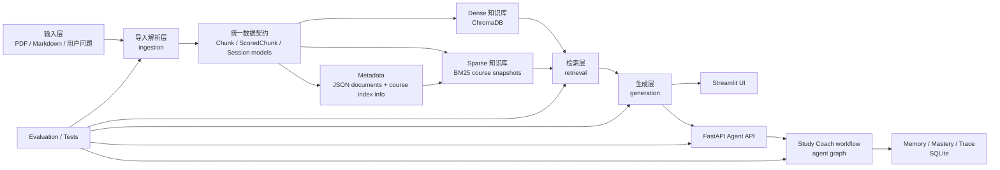

# final-agent Architecture Overview

## 1. 文档目的

这份文档用于从整体上说明 `final-agent` 当前的系统结构、模块边界、数据流、技术栈、执行阶段与后续工作方向。

它面向三类场景：

- 项目汇报时快速讲清楚系统怎么工作
- 面试时说明为什么这样拆模块、为什么这样演进
- 后续继续开发或部署时，作为总架构入口文档

---

## 2. 项目定位

`final-agent` 最初是一个基于 RAG 的复习助手，当前已经演进为：

- 一个以课件知识库为底座的学习系统
- 一个支持多种复习模式的问答与总结产品
- 一个带有 `Study Coach` 工作流的 bounded agent 应用

当前版本不是“全自动自治 Agent”，而是“有边界、可测试、可解释、可扩展”的学习辅助系统。

---

## 3. 总体架构



前端边界说明：

- Streamlit 仍是当前主 UI。普通 RAG 问答、总结、文档导入和知识库管理仍由 Streamlit 直接调用本地 Python 模块。
- Study Coach 仍通过 `AgentApiClient -> FastAPI Agent API -> agent workflow -> SQLite` 这条服务链路运行。
- Apple-like UI 重构只改变产品交互层的信息架构和视觉呈现，不要求新增 API endpoint、Pydantic schema、数据库表或 agent workflow。

---

## 4. 分层说明

### 4.1 输入与导入解析层

职责：

- 接收 PDF 或 Markdown 课件
- 把 PDF 转成可继续处理的 Markdown
- 把文档切成结构化 `Chunk`

核心文件：

- `src/final_agent/ingestion/importer.py`
- `src/final_agent/ingestion/doubao_parser.py`
- `src/final_agent/ingestion/chunker.py`
- `src/final_agent/schemas.py`

技术栈：

- `pypdfium2`
- Doubao / Ark OpenAI-compatible API
- Markdown
- Pydantic

当前实现：

- PDF 默认走 Doubao VLM 解析链路
- Markdown 可直接导入
- chunker 支持标题感知、递归子分块、overlap、页码追踪

---

### 4.2 知识库构建层

职责：

- 为 `Chunk` 生成 embedding
- 写入向量库
- 构建与维护稀疏索引
- 记录文档与课程级 metadata

核心文件：

- `src/final_agent/knowledge/embedder.py`
- `src/final_agent/knowledge/vector_store.py`
- `src/final_agent/knowledge/builder.py`
- `src/final_agent/knowledge/metadata.py`
- `src/final_agent/knowledge/bm25_index.py`

技术栈：

- `sentence-transformers`
- `ChromaDB`
- `rank-bm25`
- `jieba`
- JSON metadata

当前实现：

- dense 路径使用 ChromaDB，并已从单一全局 collection 演进为课程级 collection
- sparse 路径已从“全局单 BM25 缓存”升级为“按课程分区的 BM25 snapshots”
- metadata 记录 `course_id`、`chunk_count`、`bm25_snapshot_path`，并支持显式创建空课程
- 文档导入/删除时只重建受影响课程
- 旧全局 Chroma 数据保留为兼容来源，可按课程迁移到新的课程级 collection
- 课程知识库维护封装为“修复当前课程知识库”，底层执行旧 dense 数据迁移和 sparse snapshot 重建

---

### 4.3 检索层

职责：

- 同时执行 dense 与 sparse 检索
- 融合候选结果
- 重排序与过滤

核心文件：

- `src/final_agent/retrieval/hybrid_searcher.py`
- `src/final_agent/retrieval/pipeline.py`
- `src/final_agent/retrieval/query_expander.py`
- `src/final_agent/retrieval/reranker.py`
- `src/final_agent/retrieval/filter.py`

技术栈：

- Chroma cosine search
- BM25
- `ThreadPoolExecutor`
- RRF
- cross-encoder rerank

当前实现：

- dense + sparse 并行检索
- 稀疏检索按课程惰性加载
- 支持单课程、多课程、无 scope 检索
- 无 scope 时按 metadata 中所有已注册课程逐个装载，而不是全库预热

---

### 4.4 生成与校验层

职责：

- 生成问答结果与复习内容
- 对答案引用做一致性检查

核心文件：

- `src/final_agent/generation/answer_generator.py`
- `src/final_agent/generation/summarizer.py`
- `src/final_agent/generation/guard.py`
- `src/final_agent/generation/llm_client.py`

技术栈：

- DeepSeek API
- prompt templates
- reranker-based hallucination checking

当前支持模式：

- `qa`
- `deep`
- `page_by_page`
- `full_summary`
- `key_points`

当前实现：

- QA 走 hybrid retrieval -> rerank -> answer generation
- Deep 模式支持高召回与邻居扩展
- Summary 模式支持面向整篇文档或逐页输出
- 幻觉校验会逐句核对引用 chunk 的语义一致性

---

### 4.5 产品交互层

职责：

- 面向用户提供上传、问答、总结、课程切换、模型切换、结果可视化

核心文件：

- `src/final_agent/ui/app.py`
- `src/final_agent/ui/knowledge_status.py`
- `src/final_agent/ui/study_coach_view.py`
- `src/final_agent/ui/agent_client.py`

技术栈：

- Streamlit
- 本地 JSON 持久化
- matplotlib

当前实现：

- 文档上传
- 课程范围切换
- 新建课程与删除空课程
- 课程知识库修复/迁移入口
- 多模式切换
- Flash / Pro 按模式记忆
- 幻觉统计可视化
- Evidence 从常驻右侧栏改为按需弹出，避免压缩主问答区域
- Study Coach 模式接 FastAPI
- 启动时不再阻塞式 warmup，而是显示知识库 readiness

当前前端目标：

- 保留 Streamlit 作为主 UI，不迁移到独立 React/Next 前端。
- Apple-like Streamlit redesign 已进入实施：浅色系统字体、柔和分区、清晰状态卡片、克制蓝色强调。
- 主交互继续覆盖上传、课程切换、多模式问答、总结、引用、幻觉校验与 Study Coach。
- UI 重构只重新组织和呈现现有数据；Study Coach 的 session、mastery、trace 字段继续来自现有 FastAPI contract。
- 后续重点从“能用”转向“顺手”：课程创建、上传归属、知识库维护、引用证据查看需要形成更自然的一条学习工作流。

---

### 4.6 Agent 与服务层

职责：

- 提供 Study Coach session API
- 承载 bounded agent workflow
- 管理 quiz / grading / mastery / trace

核心文件：

- `src/final_agent/api/app.py`
- `src/final_agent/api/schemas.py`
- `src/final_agent/agent/graph.py`
- `src/final_agent/agent/tools.py`
- `src/final_agent/agent/quiz_generators.py`
- `src/final_agent/agent/graders.py`

技术栈：

- FastAPI
- typed service layer
- adapter injection

当前实现：

- 单 Agent bounded workflow
- 明确的 typed tools
- `quiz_generator` 与 `grader` 在 app/service 启动层显式装配
- deterministic fallback 已具备

---

### 4.7 Memory 与可观测性层

职责：

- 持久化 session 状态
- 保存 mastery
- 记录 quiz attempts
- 记录 ordered tool trace

核心文件：

- `src/final_agent/memory/repository.py`
- `src/final_agent/agent/mastery.py`
- `src/final_agent/agent/models.py`

技术栈：

- SQLite
- SQLAlchemy Core

当前实现：

- session 可创建、继续、完成
- mastery 按 topic 更新
- trace 可按顺序返回给 UI/API

---

### 4.8 评测与验证层

职责：

- 回归测试
- 离线评测
- 证据收集

核心文件：

- `src/final_agent/evaluation/runner.py`
- `src/final_agent/evaluation/dataset.py`
- `tests/...`
- `docs/final-agent-study-coach-demo-evidence.md`

技术栈：

- `pytest`
- `httpx` ASGI transport
- deterministic evaluation harness
- coverage
- ruff

当前实现：

- baseline suite
- `agent-final` suite
- 本地 `data/markdown` 驱动的 local-course evaluation
- API contract tests
- UI render tests

---

## 5. 两条主执行链路

### 5.1 课件导入链路

```text
PDF / Markdown
    -> importer
    -> doubao_parser or markdown direct load
    -> chunker
    -> Chunk list
    -> embedder
    -> ChromaDB add
    -> build_index_for_course
    -> metadata register_document
```

结果：

- dense 检索数据写入 Chroma
- sparse 检索快照写入课程级 BM25 snapshot
- metadata 更新文档与课程信息

### 5.2 用户问答 / Study Coach 链路

```text
User question
    -> retrieval pipeline
    -> hybrid_search
    -> dense retrieve + sparse retrieve
    -> RRF
    -> rerank/filter
    -> answer/summarize
    -> hallucination guard
    -> UI or API response
```

如果走 Study Coach：

```text
User goal
    -> FastAPI session
    -> run_study_turn
    -> search_course_material
    -> generate_quiz
    -> wait_for_answer
    -> grade_answer
    -> update_mastery
    -> next_action + trace
```

---

## 6. 当前执行阶段

截至目前，项目已经完成以下阶段：

1. 基础工程与环境搭建
2. PDF/Markdown 导入与 chunk 化
3. Chroma + BM25 混合知识库
4. 多模式问答与总结
5. 幻觉检测与引用可视化
6. Study Coach bounded agent
7. API / UI 证据链闭环
8. 课程级知识库扩缩容优化
9. 课程级知识库产品化收口
10. Apple-like Streamlit UI polish 初步落地

当前所在阶段：

- 已经越过“功能原型完成”和“课程级稀疏索引优化”
- 正在进行“可部署前的性能、稳定性、扩展性优化”
- 同步处于“产品 UI polish / Apple-like Streamlit redesign”实施阶段
- 当前不是重写主架构，而是在把课程级知识库和 Study Coach 能力产品化、可解释化、可维护化

最近完成的一步：

- `Knowledgebase Scaling`
- 课程级 BM25 snapshots
- 课程级 Chroma collections
- 旧全局 Chroma 数据按课程迁移
- 显式创建课程与删除空课程
- 课程知识库修复入口
- 检索按课程惰性装载
- UI/API 去除阻塞式知识库预热
- 浅色 Apple-like UI 初步落地
- 顶部突兀暗色模块移除
- Evidence 由右侧常驻栏改为按需打开

---

## 7. 当前主要技术栈

### 后端核心

- Python 3.11
- FastAPI
- SQLAlchemy Core
- SQLite
- Pydantic

### 知识库与检索

- ChromaDB
- sentence-transformers / BGE
- rank-bm25
- jieba

### 生成与模型接入

- DeepSeek OpenAI-compatible API
- Doubao / Ark OpenAI-compatible API

### 前端与交互

- Streamlit
- matplotlib

### 工程质量

- pytest
- httpx
- ruff
- conda

---

## 8. 当前已完成与待推进

### 已完成

- 课件导入主链路
- 统一 Chunk 契约
- dense + sparse 混合检索
- 多模式问答与总结
- 幻觉检测
- Study Coach workflow
- FastAPI session API
- SQLite mastery / trace persistence
- Quiz / Grader adapter 注入层
- 课程级 BM25 快照
- 课程级 Chroma collection
- 旧知识库迁移与课程知识库修复入口
- 新建课程与删除空课程
- 启动 readiness 替代 eager warmup
- Apple-like Streamlit UI 第一轮 polish
- Evidence 按需弹出，减少主问答区拥挤

### 下一步建议

1. 收口课程管理体验：创建课程、选择课程、上传资料归属课程、删除空课程要形成清晰闭环
2. 收口知识库维护体验：修复、迁移、重建的状态提示更清楚，失败信息更可读
3. 增强部署文档，整理环境变量、启动顺序、依赖安装方式
4. 增加运行时监控，如检索耗时、课程命中率、模型调用成本
5. 把当前 deterministic quiz / grading 逐步切换到 live adapter
6. 继续强化知识库扩容能力，如后台增量构建与缓存分层
7. 增加面向真实用户的端到端验收与部署演练
8. 继续推进 Apple-like Streamlit redesign，优先改善状态可读性、引用/幻觉校验呈现与 Study Coach 可见性
9. 后端可选增强包括 `/health`、可配置 `AgentApiClient` base URL、错误状态细分；这些不是本次 UI 重构的前置条件

---

## 9. 相关文档

- 总设计：`DESIGN.md`
- 决策记录：`interviewer-note.md`
- Study Coach 证据包：`docs/final-agent-study-coach-demo-evidence.md`
- Knowledgebase Scaling 计划：`docs/superpowers/plans/2026-06-26-knowledgebase-scaling.md`
- Quiz adapter 设计：`docs/superpowers/specs/2026-06-21-quiz-generator-adapter-design.md`
- Grader adapter 设计：`docs/superpowers/specs/2026-06-21-grader-adapter-design.md`

---

## 10. 一句话总结

`final-agent` 当前已经不是单一的 RAG Demo，而是一个以课程知识库为底座、以混合检索和多模式生成提供学习能力、并通过 bounded Study Coach workflow 提供可追踪学习闭环的本地优先学习系统。
